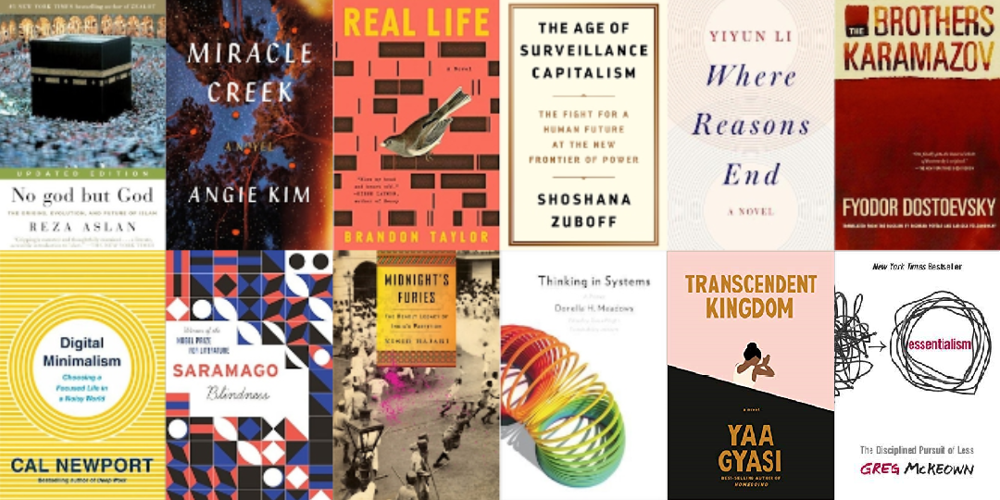
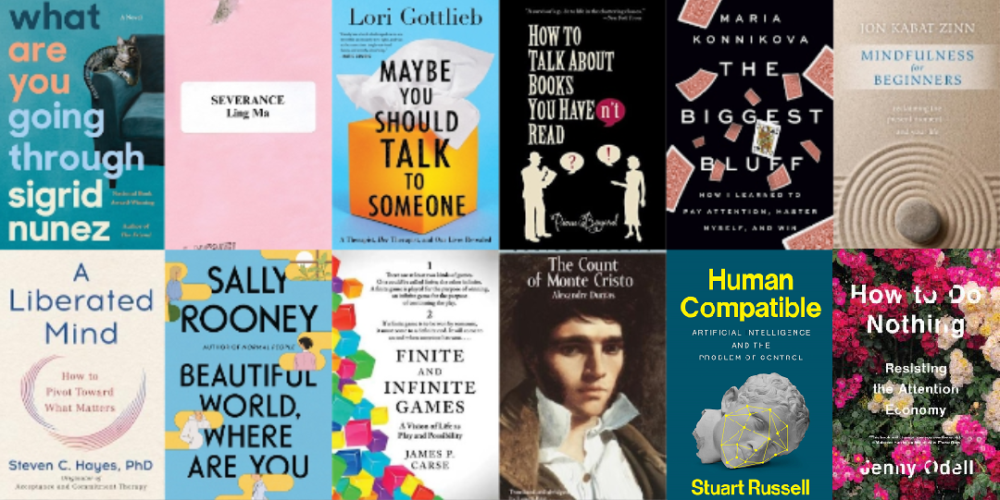

At the end of each year, I like to look back on what I've read and share my favourites. I missed last year, so this post will do double-duty. If you'd like, you can read my round-ups for [2018](https://juliariec.wordpress.com/2018/12/16/2018-reads/) and [2019](https://juliariec.wordpress.com/2019/12/30/2019-reads/) on my old blog.

This year I've decided not to divide the books by fiction and non-fiction but to simply list them in chronological order by date finished.

The question I used to guide this post: **if I could have read only 12 of the** **_n_** **books I read this year, which ones would I choose?**

## 2020

I read [53 books](https://www.goodreads.com/user/year_in_books/2020/20764973) in 2020, with a particular (but unintentional!) focus on debut novels and personal development books. It was a good year for reading, and there were a few strong contenders that didn't quite make this list.

### 1. "No god but God" by Reza Aslan

I know a lot about Christianity, but embarrassingly little about most other world religions. _No god but God_ is a highly readable introduction to Islam that tells the story of the religion and explains some common misconceptions about the faith; if you're interested in learning about Islam, I'd recommend this as a good place to start.

_Read my initial review [here](/bookshelf/no-god-but-god/) or view the book on Goodreads [here](https://www.goodreads.com/book/show/40411388-no-god-but-god)._

### 2. "Miracle Creek" by Angie Kim

_Miracle Creek_ is an enthralling novel about the mysterious explosion of a treatment center and the investigation that follows. I'm often wary of books that seem too plot-centric, but this story is a page-turner with excellent character and thematic development too. If you're just looking for a great novel to read, this would be a top pick from me!

_Read my initial review [here](/bookshelf/miracle-creek/) or view the book on Goodreads [here](https://www.goodreads.com/book/show/40121959-miracle-creek)._

### 3. "Real Life" by Brandon Taylor

I have a soft spot for measured, character-centric stories and for college novels: _Real Life_ is both. It's a zoomed-in look at the experience of a gay black grad student, Wallace, over the course of one weekend. The novel is slow-paced, but reflective and raw. If you've already read it, you would probably also enjoy [_Swimming in the Dark_](https://www.goodreads.com/book/show/49977811-swimming-in-the-dark) by Tomasz Jedrowski or [_Chemistry_](https://www.goodreads.com/book/show/31684925-chemistry) by Weike Wang.

_Read my initial review [here](/bookshelf/real-life/) or view the book on Goodreads [here](https://www.goodreads.com/book/show/46263943-real-life)._

### 4. "Where Reasons End" by Yiyun Li

_Where Reasons End_ is an imagined conversation between a mother and her son who committed suicide. The book is absolutely stunning, but hard to describe beyond that &mdash; an instant favourite for me.

_Read my initial review [here](/bookshelf/where-reasons-end/) or view the book on Goodreads [here](https://www.goodreads.com/book/show/40147915-where-reasons-end)._

### 5. "The Brothers Karamazov" by Fyodor Dostoyevsky

I read a lot of books that I enjoy, but I'm always looking for one that will blow me away. _The Brothers Karamazov_ was that for me: absolutely spectacular and a novel that I can envision myself re-reading again and again. The story is a family drama about love, murder, money, and religion and resembles [_Crime and Punishment_](https://www.goodreads.com/book/show/7144.Crime_and_Punishment) a bit&mdash;the eclectic array of characters, the philosophical conversations&mdash;but has much more of an "epic" feel to it. I know that 800-page Russian novels aren't exactly light reading, but I soared through this one and I loved it.

_Read my initial review [here](/bookshelf/the-brothers-karamazov/) or view the book on Goodreads [here](https://www.goodreads.com/book/show/4934.The_Brothers_Karamazov)._

### 6. "The Age of Surveillance Capitalism" by Shoshana Zuboff

This book is a tour de force. The two greatest strengths of the book, in my opinion: its historical account of surveillance capitalism is clear, and its exploration of surveillance capitalism's philosophical and societal implications is compelling. When I began reading more about the topic after finishing this book, I realized just how useful it is to have a comprehensive understanding of the issue and what's at stake; not only did it teach me a lot, but it has helped shed so much light and clarity on what I've learned afterwards.

_View the book on Goodreads [here](https://www.goodreads.com/book/show/26195941-the-age-of-surveillance-capitalism)._

### 7. "Digital Minimalism" by Cal Newport

If you, like me, feel overwhelmed by constantly being online and are looking for ways to structure your own digital life, I think _Digital Minimalism_ is a great place to start. Newport outlines his "digital minimalist" philosophy and then suggests practical tips for living it out. I appreciated the emphasis on intentionality, and I completely reshaped my relationship to solitude after reading the chapter on it.

_Read my initial review and notes [here](/bookshelf/digital-minimalism/) or view the book on Goodreads [here](https://www.goodreads.com/book/show/40672036-digital-minimalism)._

### 8. "Blindness" by José Saramago

_Blindness_ is a fictional account of an epidemic of blindness that confines the afflicted to an abandoned mental hospital: an exploration of human nature in the face of adversity, disease, and societal collapse. I didn't particularly _enjoy_ reading this novel&mdash;the prose was challenging to follow, and many parts were deeply disturbing&mdash;but I found it striking and timely.

_Read my initial review [here](/bookshelf/blindness/) or view the book on Goodreads [here](https://www.goodreads.com/book/show/40495148-blindness)._

### 9. "Midnight's Furies" by Nisid Hajari

Much like _No god but God_, I read _Midnight's Furies_ because I realized that I knew absolutely nothing about Indian history or politics. It does include some historical context, but the book is actually an incredibly detailed account of [Partition](https://en.wikipedia.org/wiki/Partition_of_India) specifically. Although it wasn't a historical overview, I did learn a lot about India and Pakistan by reading it, and it's probably single-handedly responsible for everything I currently know about Indian geography.

_Read my initial review [here](/bookshelf/midnights-furies/) or view the book on Goodreads [here](https://www.goodreads.com/book/show/22827628-midnight-s-furies)._

### 10. "Thinking in Systems" by Donella H. Meadows

Whenever I think about this book now, I just think about the [visakanv post](http://www.visakanv.com/blog/systems-thinking/) that starts with "To me, 'systems thinking' is just 'thinking'." I don't think I entirely agree: _Thinking in Systems_ offers some specific conceptual tools for understanding systems that you might not encounter elsewhere, and I found the overview to be informative and helpful.

_Read my initial review [here](/bookshelf/thinking-in-systems/) or view the book on Goodreads [here](https://www.goodreads.com/book/show/3828902-thinking-in-systems)._

### 11. "Transcendent Kingdom" by Yaa Gyasi

I really enjoyed [_Homegoing_](https://www.goodreads.com/book/show/27071490-homegoing), and Gyasi did not disappoint with _Transcendent Kingdom_ either. The story centres on Gifty, a neuroscience student researching depression and addiction after her brother died from an overdose, and her attempt to come to terms with the grief of losing her family and with her relationship to God and science. I think many people would enjoy this novel, but it felt particularly relevant to me given my experience growing up in the Christian church.

_Read my initial review [here](/bookshelf/transcendent-kingdom/) or view the book on Goodreads [here](https://www.goodreads.com/book/show/48570454-transcendent-kingdom)._

### 12. "Essentialism" by Greg McKeown

I think someone could justifiably write a scathing critique of this book (and in fact I'm sure someone already has), but that person will not be me &mdash; I found it immensely valuable. Rather than a productivity book about getting more things done, it focuses on how to systematically discern what is truly essential in your life and focus on that. This book transformed the way I think about tradeoffs, and after reading it, "you can't have it all" has become one of my personal mantras.

_View the book on Goodreads [here](https://www.goodreads.com/book/show/18077875-essentialism)._

## 2021

I finished [52 books](https://www.goodreads.com/user/year_in_books/2021/20764973) in 2021, of which an unusually high percentage (~60%) were non-fiction. The year had a bit of a shaky start, but I was much more intentional about my selections in the second half of the year and I feel like I ended strong.

### 1. "What Are You Going Through" by Sigrid Nunez

_What Are You Going Through_ is a story of encounters, most notably between the narrator and an acquaintance with cancer who (essentially) asks the narrator to be with her when she dies. Like the first Nunez book I read, [_The Friend_](https://www.goodreads.com/book/show/40164365-the-friend), this is a novel that unflinchingly and compassionately confronts the experience of grief; it was well worth the read.

_Read my initial review [here](/bookshelf/what-are-you-going-through/) or view the book on Goodreads [here](https://www.goodreads.com/book/show/51152434-what-are-you-going-through)._

### 2. "Severance" by Ling Ma

Published in 2018, this is a post-apocalyptic novel that critiques capitalism while telling the story of a woman surviving a global pandemic (a bit on the nose, I know). I found it illuminating and almost comforting to read this during COVID &mdash; it turned concepts of "sane" and "absurd" on their heads for me. If you're interested in labour studies, you would probably particularly enjoy this book.

_Read my initial review [here](/bookshelf/severance/) or view the book on Goodreads [here](https://www.goodreads.com/book/show/36348525-severance)._

### 3. "Maybe You Should Talk to Someone" by Lori Gottlieb

This book was a huge hit for me &mdash; it's about a therapist's experiences, not only in her own practice, but also of starting therapy herself. I was completely engrossed reading about her patients' lives, and her perspective on her work helped me understand the therapeutic process much better.

_Read my initial review [here](/bookshelf/maybe-you-should-talk-to-someone/) or view the book on Goodreads [here](https://www.goodreads.com/book/show/37570546-maybe-you-should-talk-to-someone)._

### 4. "How to Talk About Books You Haven't Read" by Pierre Bayard

I found this book through Ribbonfarm's [recommendations](https://www.ribbonfarm.com/now-reading/) and wasn't sure what to expect, but I really enjoyed it! It's entertaining and tongue-in-cheek, but actually presents some interesting ideas about the process and purpose of reading and discussing books. I think it was beneficial for me to be exposed to a perspective on literature that's much more playful and generative than my current personal approach.

_Read my initial review and notes [here](/bookshelf/how-to-talk-about-books-you-havent-read/) or view the book on Goodreads [here](https://www.goodreads.com/book/show/1143788.How_to_Talk_About_Books_You_Haven_t_Read)._

### 5. "The Biggest Bluff" by Maria Konnikova

_The Biggest Bluff_ is Konnikova's pseudo-memoir of learning poker from world champion Erik Seidel to explore the psychological and behavioural elements of the game. Since I'm interested in psychology, probability, economics, and improving my terrible poker skills, I loved reading about her journey to master the game and her reflections on the lessons she learned in the process. Vegas, here I come!

_Read my initial review [here](/bookshelf/the-biggest-bluff/) or view the book on Goodreads [here](https://www.goodreads.com/book/show/49814228-the-biggest-bluff)._

### 6. "Mindfulness for Beginners" by Jon Kabat-Zinn

I wanted to start meditating more this year, and I found this book to be a helpful introduction to the subject. It's a collection of very short chapters (~1-5 pages each) that each explore a key idea about mindfulness. I didn't try any of the guided meditations, but just reading it helped the concept form a more concrete shape in my head and gave me some [food for thought](/blog/an-affirmation-that-actually-works/).

_Read my initial review and notes [here](/bookshelf/mindfulness-for-beginners/) or view the book on Goodreads [here](https://www.goodreads.com/book/show/14098.Mindfulness_for_Beginners)._

### 7. "A Liberated Mind" by Steven C. Hayes

I read _A Liberated Mind_ to learn more about Acceptance and Commitment Therapy (ACT), and I derived a lot of value from the book. It was divided into three parts: ACT's history and underlying research, detailed explanations of the six "pivots" (or "flexibility skills") that comprise ACT, and practical applications of the pivots to different life challenges. I enjoyed the whole book, but you could also just read part two and learn a lot.

_Read my initial review [here](/bookshelf/a-liberated-mind/) or view the book on Goodreads [here](https://www.goodreads.com/book/show/43330899-a-liberated-mind)._

### 8. "Beautiful World, Where Are You" by Sally Rooney

Another excellent read from Rooney! I felt like this novel combined the strongest elements of both [_Conversations with Friends_](https://www.goodreads.com/book/show/32187419-conversations-with-friends) (the group dynamics) and [_Normal People_](https://www.goodreads.com/book/show/41057294-normal-people) (a complicated love affair). I also read her [Hazlitt interview](https://hazlitt.net/feature/what-does-it-mean-love-person-who-doesnt-exist-what-does-it-mean-love-person-who-does) prior to reading the novel, and noticing the deliberate lack of interior explanation in the novel made it all the more enjoyable to read.

_Read my initial review [here](/bookshelf/beautiful-world-where-are-you/) or view the book on Goodreads [here](https://www.goodreads.com/book/show/56597885-beautiful-world-where-are-you)._

### 9. "Finite and Infinite Games" by James P. Carse

This is a short text that offers a unique perspective on two different approaches (finite and infinite) to the same domains. I liked the pithy, abstract quality of the writing, and Carse's ideas are still percolating through my brain months later. It's always fascinating to read something that gives you a new language to describe the world!

_Read my initial review [here](/bookshelf/finite-and-infinite-games/) or view the book on Goodreads [here](https://www.goodreads.com/book/show/189989.Finite_and_Infinite_Games)._

### 10. "The Count of Monte Cristo" by Alexandre Dumas

My younger sister had been recommending this novel to me for years, and I finally read it this year. It's known as one of the best "revenge novels" ever written and tells the tale of Edmond Dantès, who is falsely imprisoned but escapes to wreak vengeance on the men that ruined his life. The book was fast-paced, super dramatic, and very fun to read &mdash; almost like watching an action movie.

_Read my initial review [here](/bookshelf/the-count-of-monte-cristo/) or view the book on Goodreads [here](https://www.goodreads.com/book/show/7126.The_Count_of_Monte_Cristo)._

### 11. "Human Compatible" by Stuart Russell

I started to learn more about AI safety this summer and picked _Human Compatible_ as my foray into the field. I would highly recommend it to anyone interested in the implications and dangers of superintelligent AI &mdash; it's an appropriately scoped overview and covers the most important topics without getting too technical.

_Read my initial review and notes [here](/bookshelf/human-compatible/) or view the book on Goodreads [here](https://www.goodreads.com/book/show/44767248-human-compatible)._

### 12. "How to Do Nothing" by Jenny Odell

This book was lovely, timely, and not at all what I expected. Rather than a prescriptive method for rest, it's a collection of reflections and lessons about safeguarding attention, inhabiting physical space and time, being connected to your natural environment, and learning to see. I'd especially recommend this to anyone who likes art and nature!

_Read my initial review and notes [here](/bookshelf/how-to-do-nothing/) or view the book on Goodreads [here](https://www.goodreads.com/book/show/42771901-how-to-do-nothing)._

## Reflections

In my [previous post](/blog/never-plan-what-book-to-read), I explained why I don't like planning ahead when it comes to reading: I like to read whatever catches my interest at the moment. These lists affirm that principle for me &mdash; with a few exceptions, timing was an essential aspect of each book's importance to me.

While writing this, I also noticed that many of the non-fiction books that I really enjoyed were broad in nature, either because they were overviews of something I wanted to learn or explorations of a topic that I'm interested in. I've found Cedric Chin's theory of [3 kinds of non-fiction books](https://commoncog.com/blog/the-3-kinds-of-non-fiction-book/) to be a helpful framework for differentiating between what I'm reading, and in general I think my patience for "branch" books (which are more focused and detailed) just ebbs and flows with time.

I love reading fiction, but I've had difficulty picking the right novels for me &mdash; for example, of the 20 new novels I read this year, I only "really enjoyed" or "loved" 6 of them. I think I'm currently relying too much on the synopsis and not enough on the novel's reputation, so I might pivot to more classics and personal recommendations this year and see how that goes.

Overall, though, I'm happy to have shared some of my top hits here, and I'm excited to dive into some more excellent books in 2022. As always, I'd love to hear your thoughts, responses, and book recommendations, so please don't hesitate to [contact me](mailto:hello@juliariec.com) or comment below to share them!
