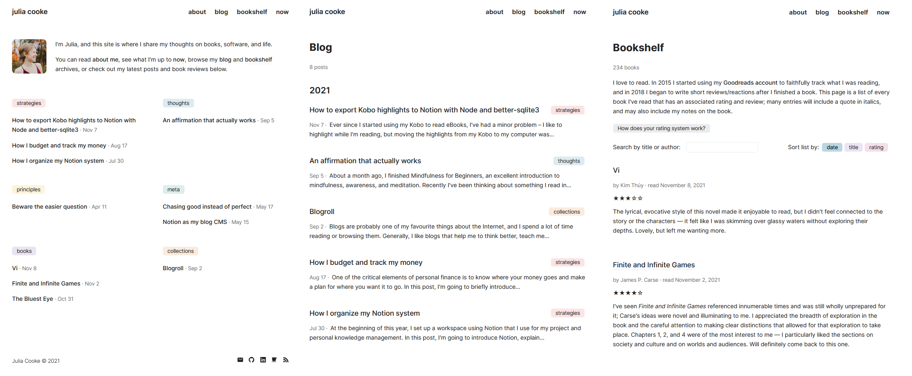

I've been updating the design and appearance of this blog for the last six months, and I've finally reached a point where I want to say: **This is version 1.** I need something concrete to stop me from continuing to second-guess the structure, and this post is it!

## Designing the site

This is what version 1 looks like:

My goal for the first iteration of my site was to make it simple to start and then see where to go from there.

> Everything should be made as simple as possible, but not simpler.
>
> — attributed to Albert Einstein

At times, I found it difficult to decide what was necessary and what was extraneous. For example, I originally didn't want to categorize my posts, but later decided that sorting them very broadly might help readers navigate the breadth of what I wanted to write about. I imagined someone visiting my blog exclusively to read my musings and wanted to make it easy for them to find those specifically.

I've included this example to illustrate what I think is the main lesson I took away from designing my site from scratch:

> Understanding how something will be used is absolutely crucial to designing it well.

Most of the decisions I had to make came from questions I asked myself about the site's usage — who would be using it and for what purpose. These are some of the considerations I made:

- Who will be visiting the homepage? Will it be someone who reads my blog regularly (in which case I should show them my most recent post, so they can read it immediately) or someone who's seeing it for the first time and needs more context?
- Will the person reading the "About" page know me? What kind of information about me will they be hoping to find?
- When someone looks at my bookshelf, will they be interested in the titles? The reviews? The ratings? Will they be looking for a specific book, or just generally curious?
- Will it matter to readers when a post was published or updated?

...and so on. I didn't know the answers to many of my own questions, which meant that I had to use my best judgment. Part of my excitement with releasing version 1 is that I can shift my focus to my site content and hopefully learn more about how my site is used over time.

Working on the design was also such a clear reminder that **what I look for has such an influence on what I see**. I regularly visit at least a dozen blogs, but when I tried to picture what their sites looked like, my mind went totally blank. Now, whenever I'm on someone's website, I pay close attention to how it's structured and designed, and I think about what works or doesn't work or what I like and don't like. It's like attending a wedding: you spend a lot of time thinking about whether or not you'd want their decorations, their dress styles, or their music at your own wedding (or at least I do)!

## Inspirations and influences

I spent a lot of time looking at other websites (and occasionally GitHub repositories...) for inspiration. Some definitive inspirations that deserve due credit:

- I used [Jared Palmer](https://jaredpalmer.com/)'s layout as the model for my header and footer.
- Andrew Healey's [homepage](https://healeycodes.com/) gave me the idea to include a mini bio and feature my most recent posts. I was also so impressed with how beautifully his slight modification to the letter spacing on the font we both use, Inter, looked, but I concluded that "borrowing" that would be a step too far!
- I enjoyed binge-reading [Justin Duke](https://arcana.computer/catalogs/books) and [Derek Sivers](https://sive.rs/book)' book lists so much that I decided putting my own reviews on an infinite scroll list was the way to go.
- The idea and implementation of [utteranc.es](https://utteranc.es/) for my blog comments came from Tania Rascia's [blog post](https://www.taniarascia.com/adding-comments-to-my-blog/). Her site is also where I first saw the "buy me a coffee" sponsorship model.
- All of the colours for my buttons are replicated from [Notion](https://notion.so).

## Moving forward

Now, time for the public commitment: less code tweaking, more word writing :) See you there!
