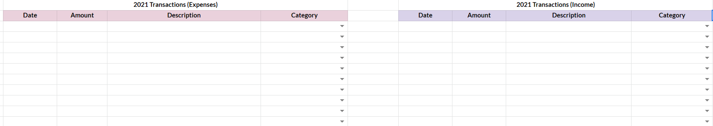
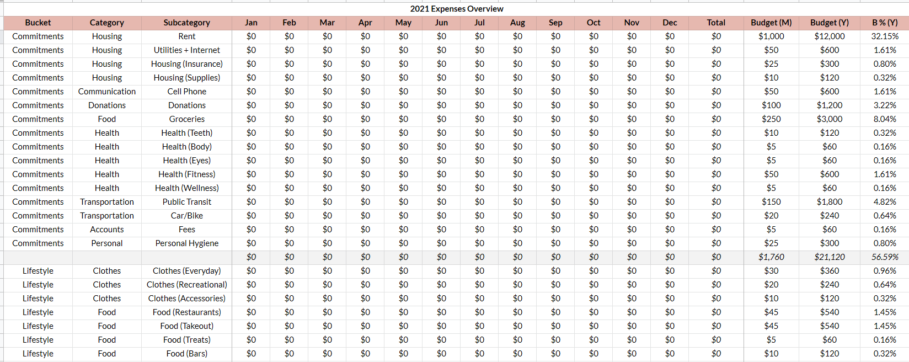

One of the critical elements of personal finance is to know where your money goes and make a plan for where you want it to go. In this post, I'm going to briefly introduce budgeting and money tracking, and then share my strategy and how I've set up my own tracking spreadsheet. My hope is that you will come away with some ideas about how you could organize your money habits to reach your financial goals.

## Introduction to budgeting and money tracking

### What is a budget and why should I have one?

A budget is a financial plan, typically used to help you reach some kind of financial goal. These goals will vary depending on the person — paying off debt, kicking a bad spending habit, or saving up for a big purchase or for retirement.

> A goal without a plan is just a wish.  
> —Antoine de Saint-Exupéry

Before making a budget, then, it makes sense to think about your financial goals. For example, one of my short-term goals is to save up money to travel to Vietnam and Thailand, and one of my long-term goals is retirement.

The benefit of setting goals is twofold:

1. It helps you crunch the numbers for your budget.
2. It gives you motivation, because you have a reason to budget, track, and save.

Budgeting comes in many forms, which we'll look at later.

### What's the benefit of tracking my money?

If you have a plan for how you'll use your money, but no idea about how you actually use it, you have no way of knowing whether or not you're following the plan.

The extent to which you'll need to track your money depends on which budget you decide to use.

Aside: if you're really interested in improving your financial health by tracking expenses, I'd highly recommend reading _[Your Money or Your Life](https://www.goodreads.com/book/show/78428.Your_Money_or_Your_Life)_ by Vicki Robin and Joe Dominguez (you can read my review [here](https://www.juliariec.com/bookshelf/your-money-or-your-life/)). It involves not only tracking your expenses but rating them based on how closely they align with your personal values :)

## Different kinds of budgets

### 1. The 50/30/20 Budget

This budget was popularized by Senator Elizabeth Warren and recommends the following rule of thumb for spending your income:

- **50%** on "needs" (rent, utilities, groceries)
- **30%** on "wants" (hobbies, vacations, restaurants)
- **20%** on savings

I think this framework is a helpful jumping-off point for creating your budget, which you can tweak according to your needs. For example, the general advice is that rent should be no more than 25-33% of your income, but in some places (like Toronto) that might not be realistic, meaning that the 50% for needs may not work out.

[This article](https://www.thebalance.com/the-50-30-20-rule-of-thumb-453922) provides a more thorough overview of how this budget works.

### 2. Zero-Based Budgeting

In this budget, you assign every dollar to a spending category until there are no more dollars to assign. The process of carefully managing every dollar in your budget helps you establish where your money goes and decide where you want it to go. This strategy is the framework behind the wildly popular app [You Need a Budget](https://www.youneedabudget.com/) (YNAB).

The Balance has another [helpful article](https://www.thebalance.com/zero-based-budgeting-5186319) for zero-based budgeting (ZBB).

### 3. The Anti-Budget

Also known as "pay yourself first", the idea with the anti-budget is that you save a certain percentage of your income first and do whatever you like with the rest.

As you can tell, this budget does not involve much tracking, but can leave you in the dark about where you actually spend money.

Your budget may not neatly fall into one of these three kinds; these are just different approaches that provide helpful ways of thinking about how to divide or track your money.

## My strategy

I like the concept of the anti-budget, but I like tracking things in spreadsheets more. My strategy is a mix between ZBB and the anti-budget — I prioritize my savings and investments (my "saving" buckets), and divide whatever is leftover between essentials and lifestyle (my "spending" buckets).

Instead of thinking about "needs" and "wants", I found it helpful to reframe my buckets as "essentials" and "lifestyle". There are things that I don't technically _need_, like a gym membership and recurring donations, which are important enough to me that I prefer to consider them as non-negotiable.

I'm very flexible when it comes to rearranging my "lifestyle" bucket and very reluctant to mess with my saving categories. In that sense, I'm following the anti-budget, but monitoring what I end up spending "everything else" on.

The zero-based budget mentality has been useful for helping me understand my financial tradeoffs — I can spend more money on buying new clothes, but that money has to come from _somewhere_. It can come from my free time (by working more to make more money) or my other lifestyle categories (like eating out), but it can't come from my savings.

## My tools

You can quote me on this: nothing beats a spreadsheet. I use Google Sheets — after all, you never know when you'll need to track your finances :)

On my spreadsheet, I have a "Transactions" section where I manually enter all of my expenses and income. At the end of every month, I take about 15 to 30 minutes to look at my credit cards and savings account and record everything, sorting them into their respective subcategories. This is also an opportunity for me to review all my transactions and make sure there haven't been any unusual or fraudulent charges on my accounts.

The main view is the "Overview", which automatically pulls the information from transactions and displays them by month and by category, and shows me some useful totals.

### How I set up the spreadsheet

I started by defining my own categories and subcategories (at a fairly granular level because it was of interest to me). The sheet automatically provides all of the values from the "subcategory" column as options for the "category" in the transaction list.

The next step was to set up my monthly budget. I went through each subcategory and set a desired monthly amount, which the spreadsheet then displays as a yearly amount and as a percentage of total income.

I set up both the "total" column and a grey row at the bottom of each bucket so that I can view totals by subcategory across the year or by month across the buckets. This is also handy in that I can reference the total percentage for each bucket to get a sense for what my needs/wants/savings breakdown is.

## Getting started with budgeting and tracking

If you're interested in using or adapting my spreadsheet for yourself, you can download a copy of it [here](https://www.buymeacoffee.com/juliariec/e/41116). If you aren't keen on the idea of manual data entry, banks often provide a way to export your account data as a CSV file, which may come in handy.

If you're not a spreadsheet person, I've heard excellent things about [Mint](https://mint.intuit.com/) ([Android](https://play.google.com/store/apps/details?id=com.mint), [iOS](https://apps.apple.com/us/app/mint-personal-finance-money/id300238550)) and [YNAB](https://www.youneedabudget.com/) ([Android](https://play.google.com/store/apps/details?id=com.youneedabudget.evergreen.app), [iOS](https://apps.apple.com/us/app/ynab-you-need-a-budget/id1010865877)), but have never seriously used either of them.

It can be a lot to get started all at once, so it may be helpful to just track your expenses for a few months to get an idea of where your money goes before you start to create a budget. As I mentioned earlier, I also find it helpful to set financial goals for extra motivation.

Below, I've compiled a list of some additional resources that may help you with your personal finance practices.

## Additional resources

- I love Paula Pant's financial website [Afford Anything](https://affordanything.com/start-here/). She does a fantastic job of articulating financial tradeoffs ("you can afford anything, but you can't afford everything") and "[minding the gap](https://affordanything.com/the-most-crucial-money-lesson-in-three-words-mind-the-gap/)" between spending and saving. I also subscribed to her newsletter for a bit and I learned a lot!
- The [Personal Finance Canada subreddit](https://www.reddit.com/r/PersonalFinanceCanada/) has a solid wiki with some advice on [money steps](https://www.reddit.com/r/PersonalFinanceCanada/wiki/money-steps) and [recommended reading](https://www.reddit.com/r/PersonalFinanceCanada/wiki/reading-list) for personal finance.
- If you're researching how much to save for retirement, the [Government of Canada](https://www.canada.ca/en/financial-consumer-agency/services/retirement-planning/money-to-retire.html) has some helpful resources, or you could use Sun Life's [retirement savings calculator](https://www.sunlife.ca/en/tools-and-resources/tools-and-calculators/retirement-savings-calculator/).
- I often use Talent.com's Canadian [income tax calculator](https://ca.talent.com/tax-calculator) for making income predictions.
