At the beginning of this year, I set up a workspace using [Notion](https://notion.so) that I use for my project and personal knowledge management. In this post, I'm going to introduce Notion, explain my approach to creating my system, and walk through its core features. After reading this, you'll have an overview of what Notion is and how you could use it to set up your own system. As a disclaimer I'm not affiliated with Notion in any way, I'm just interested in sharing my own experience. Let's get started!

## What is Notion?

Notion is an 'all-in-one' productivity tool. The idea is that instead of dividing information between tools like Google Docs, Evernote, and Excel, you can include everything in the same place – Notion.

The basic unit in Notion is called a **block**, which can be a heading, a paragraph, a to-do list, an image, an embedded map, a code snippet... you get the picture. **Pages** in Notion contain one or more blocks, and pages can also be nested within each other.

One important feature of Notion that I'll highlight here is the concept of a **database**. You can think of a database as a collection of Notion pages, all of which share the same properties. For example, if you used Notion to track professional contacts, you might have a _Contacts_ database where each page represents a person that has associated properties, such as their email address, mobile phone number, and birthday. Notion supports over a dozen types of properties, including text, numbers, dates, checkboxes, and URLs.

Notion allows you to **view** the same database in multiple different ways. With your _Contacts_ database, you could define a _table_ view that displays them like a spreadsheet, a _gallery_ view which shows their photos in a grid, or a _calendar_ view that displays each person on a calendar according to their birthday. The power of views is that they enable you to interact with the same information in different ways, depending on your use case.

These concepts will make more sense as we dive into my Notion system. However, if you're unfamiliar with Notion and are interested in a more comprehensive introduction, you may find Keep Productive's [Beginner's Guide to Notion](https://www.keepproductive.com/blog/notion-for-beginners) or The Leadership Journal's [Day 1 with Notion](https://medium.com/the-leadership-journal/how-to-use-notion-day-one-a136c5de8fef) helpful places to start.

## My organizational approach

### System inspiration

I started my research by reading through Tiago Forte's [PARA Method](https://fortelabs.co/blog/para/). In this method, you divide your digital information into four categories, which I'm copying verbatim from the original post:

1. A **project** is 'a series of tasks linked to a goal, with a deadline', like 'develop a web app by December'
2. An **area of responsibility** is 'a sphere of activity with a standard to be maintained over time', like 'finances'
3. A **resource** is 'a topic or theme of ongoing interest', like 'minimalism'
4. The **archive** includes 'inactive items from the other three categories'

After looking into this method, I agreed that differentiating between projects and areas is essential. However, I didn't like the idea of 'Resources', mainly because I thought it would be too energy-intensive to categorize every note and idea I ever had. Since it didn't fully meet my needs, I went searching for a complementary strategy.

What I found was the Notion VIP [Bulletproof Workspace](https://www.notion.vip/bulletproof-2/), which integrates principles of PARA with other productivity systems. As part of this system, you create three main sections for your Notion pages and databases:

1. **Buckets** are high-level categories (essentially equivalent to PARA's **areas**)
2. **Bolts** are action-based databases, like projects, tasks, and events
3. **Bytes** are reference-based databases, like documents and external resources

The core principle of the Bulletproof Workspace is:

> centralize information in related master databases; then filter and format that information within contextual dashboards.

This system made a lot of sense to me. In particular, I liked the framing of areas as categories (or 'buckets') that your 'bolts' and 'bytes' fit into. The workspace was also designed for Notion in particular, and therefore takes advantage of some of Notion's powerful relational properties. I borrowed heavily from this system, then simplified it according to my needs.

### System breakdown

The core functionality of my workspace breaks down into five databases:

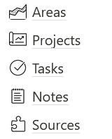

1. **Areas** are high-level categories
2. **Projects** are specific goals
3. **Tasks** are actionable to-dos
4. **Notes** are resources from my own mind (ideas, notes)
5. **Sources** are resources from external sources (articles, links)

Since pages can be embedded in other pages in Notion, all five of these databases are pages that live on the main 'Dashboard' of my workspace.

Now that we've covered my inspiration and approach, let's tour through my dashboard and all five of my core databases, covering key concepts in Notion as they come up.

## Walking through my system

### Dashboard

We'll start with the **Dashboard**. This is my landing page, which includes the following:

- _Goals_: a list of my goals for 2021
- _Priorities_: a _list_ view of **Tasks** which displays any tasks that are due today or overdue
- _Pages_: a section with all my databases and subpages
- _Values_: a list of my personal value statements

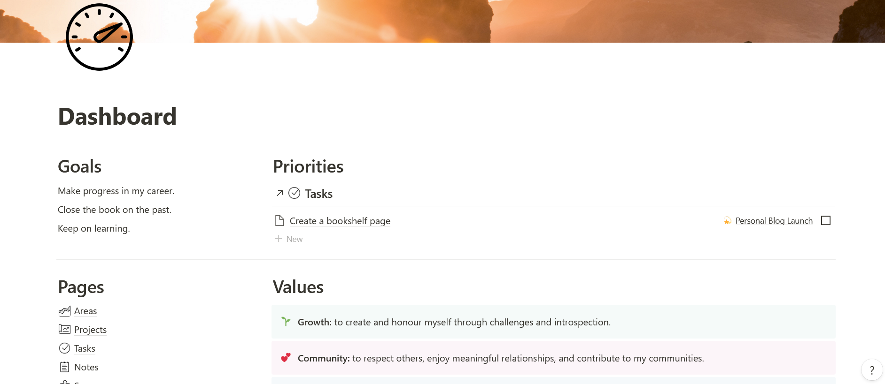

Notion supports what are called **linked databases**, which are views of a database that can be embedded anywhere in your workspace. On this page, I link to the **Tasks** database and then filter them by due date.

The ability to use linked databases is incredibly powerful and critical to the Bulletproof Workspace's core principle of centralizing information and filtering it by context. Instead of scattering things across my system, I can keep them together while still being able to customize where and when I see them.

Many users take the opportunity to be creative with their dashboards. If you're interested in more inspiration, users often share their dashboards on the [Notion subreddit](https://reddit.com/r/Notion/).

### Areas

My first core database is **Areas**. I use it with a simple _gallery_ view to centralize the high-level categories of my system.

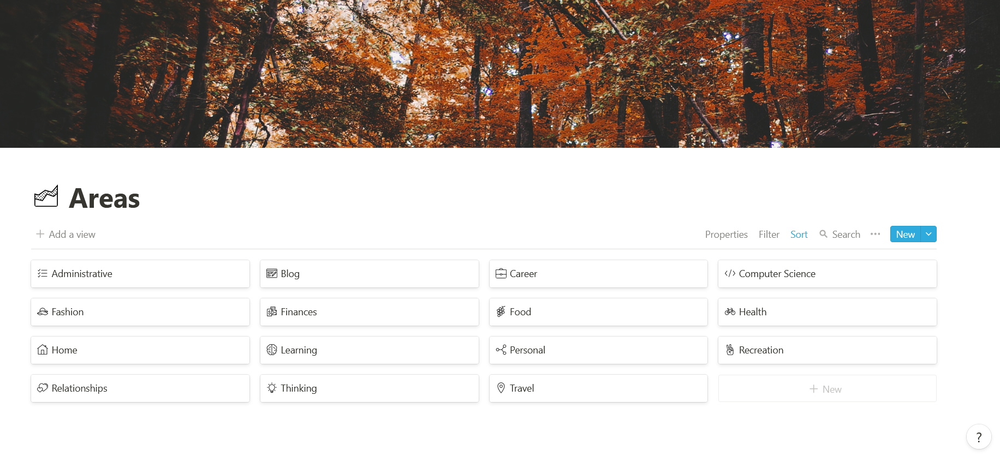

Earlier, I mentioned that Notion databases let you create properties like text, numbers, dates, checkboxes, and URLs. Alongside these basic properties, Notion also supports certain advanced properties, including what are called **relations**.

Relations mean that you can link (or 'relate') a page in one database to a page in another. In my system, all of the core databases have an 'Area' property that links them to a page in the **Areas** database. This means that **Areas** effectively defines the categories across the system, and I can view all the content from different databases that relate to the same area in one place.

To accomplish that, I used a **template** to design each 'area' page so that it shows _list_ views of all the other databases (using linked databases), filtered by the given area. For example, opening the 'Finances' page shows me lists of all the projects, tasks, notes, and sources related to my finances.

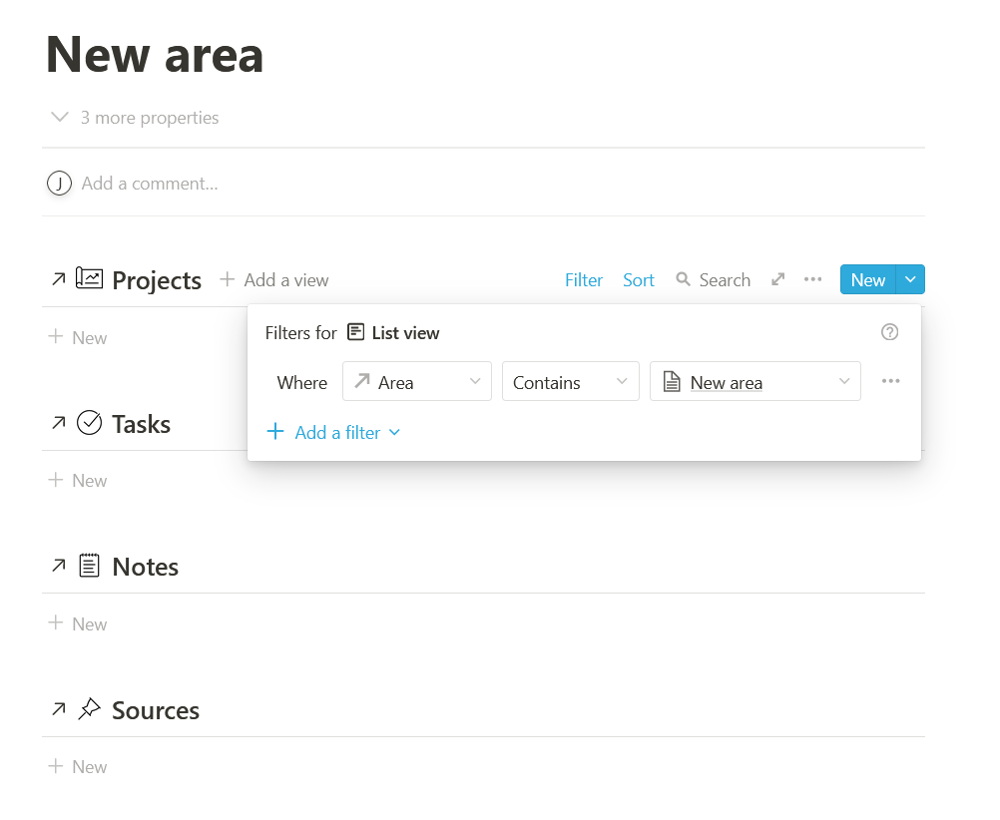

Notion lets you create **templates**, which can be used to standardize the pages in a database (or elsewhere). Every page in a database always has the same properties, but you can use templates to automatically set the value of a property, like always setting the status of new tasks to 'To-Do'. Templates can also be used to maintain consistency in the _body_ of the page, like always starting with a heading titled 'Overview'.

In this area template, I added all the linked databases, and then set up filters on them. Now, I can create a new area called 'Fitness', and when I link any project, task, note, or source to it, the 'Fitness' page in **Areas** will update to display that new connection.

These are the areas I currently have defined:

- Administrative
- Blog
- Career
- Computer Science
- Fashion
- Finances
- Food
- Health
- Home
- Learning
- Personal
- Recreation
- Relationships
- Thinking
- Travel

To make this list, I started with the basics and then refined and extended it as I began to actually use my system and determine my needs. At this point, it's relatively stable and encompasses everything I typically manage within Notion.

### Projects

The most important database to me is **Projects**. This collection helps me to focus my attention on what's most pressing right now without losing sight of what I hope to accomplish in the near or distant future. I generally use the _Kanban_ view (grouped by 'Status') to give me an overview of everything going on in my life.

Although I haven't shown it here, you can design multiple different views for the central database and toggle between them at your leisure. For example, I have another view of **Projects** called 'Inspiration', which is a _gallery_ view that displays my projects with their cover images for a more visual overview.

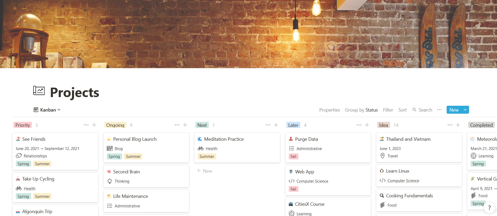

Properties that define projects include an **Area** relation, a status **select**, a timeline date (if it needs one), a progress bar formula, and a season **multi-select**.

**Selects** and **multi-selects** are useful basic properties in Notion that are similar to dropdown menus. First, you predefine options, then you establish whether you should only be able to choose one (**select**) or whether you can pick multiple (**multi-select**).

For projects, I use define the following:

- 'Status' is a **select** where I can choose 'Priority', 'Ongoing', 'Next', 'Later', 'Idea', 'Completed', or 'Retired'
- 'Season' is a **multi-select** where I can choose any or multiple of the four seasons

Another property I mentioned, the progress bar, isn't actually supported in Notion – but **formulas** are. Formulas let you define properties by performing calculations using other properties, like finding the time between two dates or checking if two numbers are equal.

This 'Progress' property actually uses another property, 'Completed' (which gives the percentage of the number of related tasks which are completed), to determine whether to show a filled or a blank dot, and then a string manipulation formula to display the full bar. How this works is beyond the scope of this post, so you can read the full explanation [here](https://notionthings.com/2021/01/15/display-a-visual-progress-bar-using-a-formula-with-15-examples/).

Projects also have related **Tasks**, **Notes**, and **Sources**, and the 'Completed' rollup property (which I will explain further when we get to **Tasks**). I hide all of those properties by default to keep the view clean.

This is what a project looks like when I open it up:

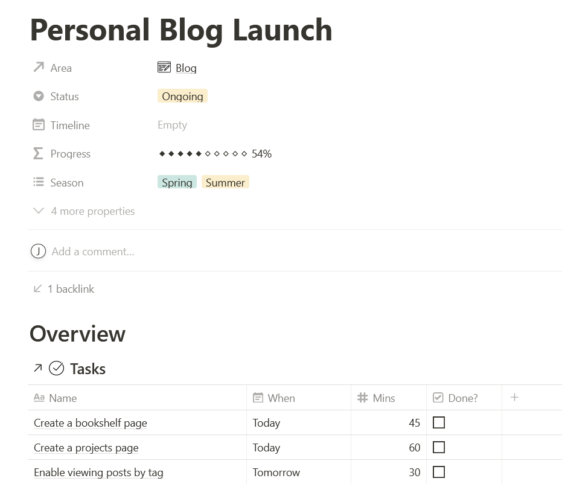

With linked databases, I can filter the **Tasks** database so that only the tasks which are 'related' to this specific project are displayed. Since I have that filter added, whenever I add a new task here, it automatically relates it to this project. I find myself using this frequently while brainstorming.

I've cropped this screenshot, but underneath this database view I use the rest of the page to record ideas and notes pertaining to my project.

### Tasks

My **Tasks** database is essentially a _table_ view of my to-do list. Every task has a name, a related **Project**, a 'do' date, a checkbox indicating whether or not I've done it, and a space to estimate how long it will take me to complete the task.

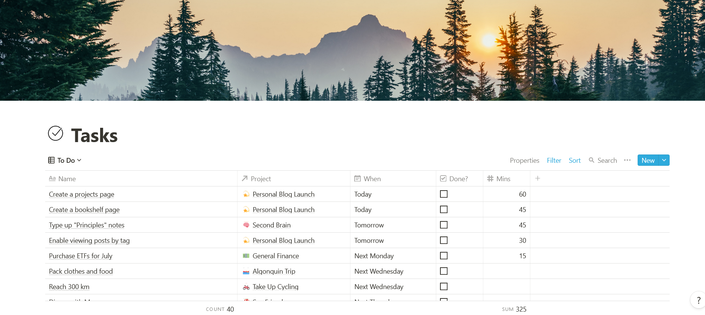

Compared to other to-do list applications, Notion's ability to support tasks is somewhat limited. One of its primary limitations is that it doesn't have any support for recurring tasks, which can be annoying. Since I use Notion for more than just my to-do list, I've accepted this shortcoming as a tradeoff, but I hope they add support for it in the future.

As you'd imagine, Notion lets you sort every database view. I have a bit of an elaborate schema for sorting my tasks:

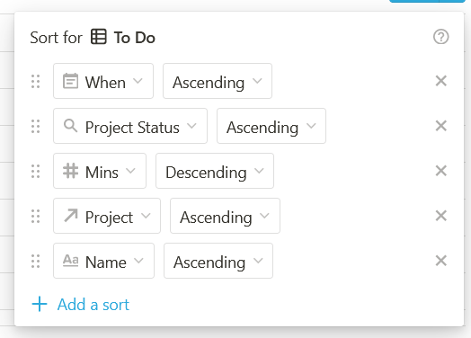

You can see here that each task also has a 'Project Status' property with a magnifying glass beside it. This is another unique property in Notion known as a **rollup**. Rollups are used in conjunction with relations and let you reference a property from a related page to your original page.

This is how it works: when I create a task, I link it to a project. Since every project has a 'Status' property, the 'Project Status' rollup just finds that status and copies it over (using a setting called 'show original'). Now, when I look at a task, I can get a sense of how urgent it is based on its related project. Incidentally, **Tasks** also uses a rollup to determine a given task's **Area** – it just copies whatever **Area** is related to the task's **Project**.

Not only can you use rollups to copy properties with 'show original', you can also perform simple calculations like counting or summing other properties. I mentioned earlier that every project has a 'Completed' property that uses a rollup. This property links **Projects** to **Tasks**, and then counts the number of tasks which are:

- Related to the project, and
- Checked as 'completed'.

Since tasks are fundamentally related to projects, being able to easily connect them is useful.

### Notes

In the Bulletproof Workspace, both the **Notes** and **Sources** databases are considered 'bytes', since they collect reference information rather than actionable points. My distinction between these two is the following:

- If the information originates from me (_internal_), it goes into **Notes**.
- If it originates elsewhere (_external_), it goes into **Sources**.

This distinction can get confusing when I start to interact with material. When I read an interesting article, save it into Notion, and start to highlight sections and make notes, should it be in **Notes** or in **Sources**? I haven't completely decided yet.

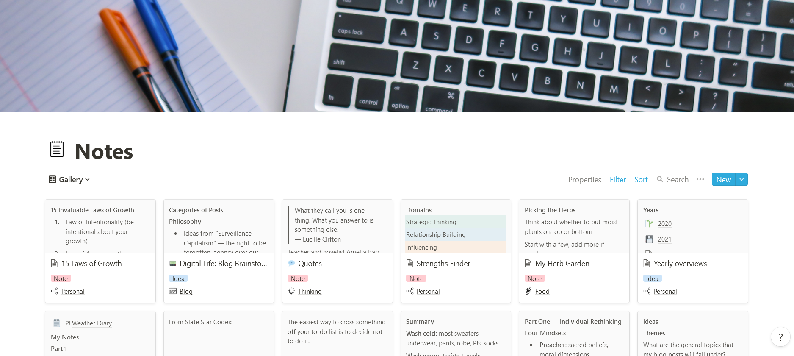

I also further decompose notes into one of four categories: notes, references, ideas, and journals, but I'm not entirely happy with this decomposition, so it's still a work in progress.

The specific domain of this database is the most hazy to me, but generally speaking, if I want to record something and need somewhere to put it, I put it in **Notes**. I use a _gallery_ view so I can see a preview of the page content at a glance, and I sort it by last modified so that my recently active notes are easy to find.

### Sources

Another advantageous element of the Notion ecosystem is that Notion users can create and share templates, which can be duplicated and used in your own workspace. My final core database, **Sources**, uses this [Link Manager Template](https://www.producthunt.com/posts/notion-link-manager) to organize its contents.

This database is what I use for all external resources and reference material. You can see here that I've further subdivided them into 'articles', 'resources', 'blogs', 'links', and 'media' types.

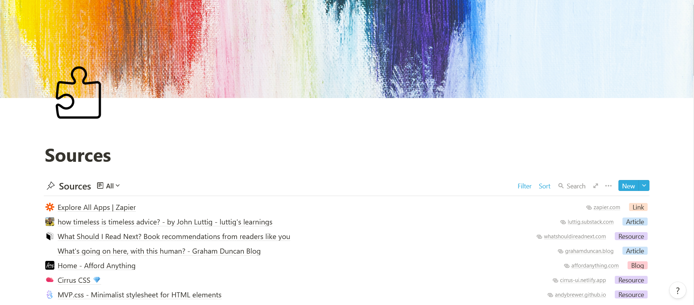

Notion offers a [web clipper browser extension](https://addons.mozilla.org/en-US/firefox/addon/notion-web-clipper/) which you can use to pull information from the web into Notion. I tried it for a while, but it didn't have the functionality I was looking for.

Luckily, I found another browser extension called [Save to Notion](https://www.notioneverything.com/tools/save-to-notion) (supported in Chrome and Firefox) that is much more powerful and can be customized according to your own needs. As a disclaimer, you should note that it is not supported or developed by Notion but by a completely independent developer, and its privacy policy is unfortunately quite vague.

To use this extension, I navigate to a webpage that I want to copy into my Notion system and click on the extension icon to bring up this menu:

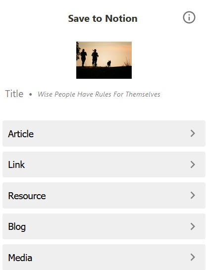

These are all **forms** that I've predefined which correlate to types of sources in my database. Let's say I want to import [an article](https://www.raptitude.com/2017/07/wise-people-have-rules-for-themselves/) into Notion. I click on my 'Article' form and it shows me this:

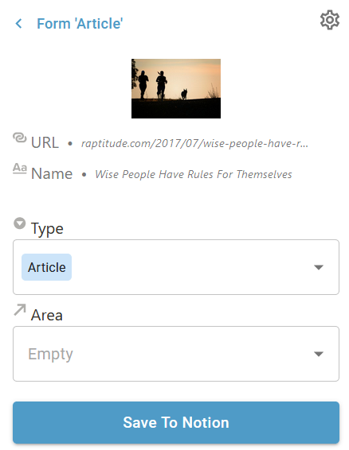

I've set up this form to link to my **Sources** database, pre-select the 'Article' type, and show me a menu for the 'Area' relation so that I can categorize it right there before saving it into my system.

This extension makes it possible to do the following:

- Customize which properties of the target database you want to display in the form
- Pick one of your Notion templates to use to create your new page
- Automatically save the webpage content into the new Notion page by scraping it from the website
- Automatically enter the site title, URL, and favicon into properties of the new page
- Lock properties to the form as defaults

This clipper extension is one of the most useful tools imaginable. Instead of managing bookmarks or copying links into notes, if there's anything I encounter that's related to any of my areas or projects, I can import it into **Sources** and create relations to my other databases with only a few clicks.

## In summary

In this post, we've covered some of the core features that Notion offers, including blocks, pages, databases, views, templates, and properties ranging from basic (text, numbers, dates, selects, multi-selects, checkboxes, and URLs) to advanced (relations, formulas, and rollups). We've also seen how to use linked databases, sorts, filters, externally created templates, and browser extensions to extend the capability of our workspace.

I've also explained how I devised my Notion system, shown how I use it, and described its design, functionality, and limitations. I used principles from PARA and the Bulletproof Workspace to create five core databases (Areas, Projects, Tasks, Notes, and Sources) that help me organize my project and personal knowledge management system.

If you've never encountered Notion before, I hope this introduction provided some insight into how it works and what it can be used for. If you have used it or you're considering setting up your own Notion system, I hope that walking you through my setup has given you new ideas about how to organize, relate, and populate your own databases.

For those interested, you can get a copy of this system to duplicate into your own workspace [here](https://www.buymeacoffee.com/juliariec/e/39050).

Please feel free to comment or [contact me](/about) if you have any questions about my Notion system. In addition to the links in this post, I've included extra resources below that helped me to get started.

## Additional resources

- [Notion Everything](https://www.notioneverything.com/) is an incredibly useful compilation of Notion resources.
- [Indify](https://indify.co/) provides cool widgets to include in your workspace.
- [Notion VIP Icons](https://www.notion.vip/icons/) is a repository of icons that I used for my own workspace.
